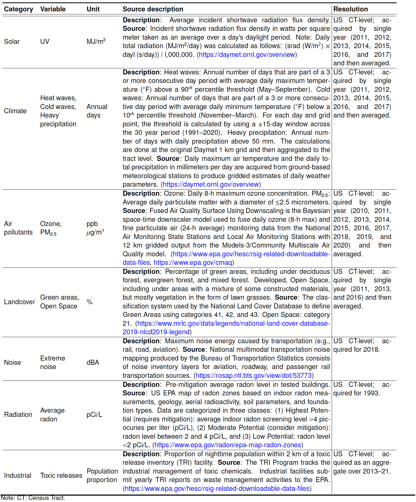
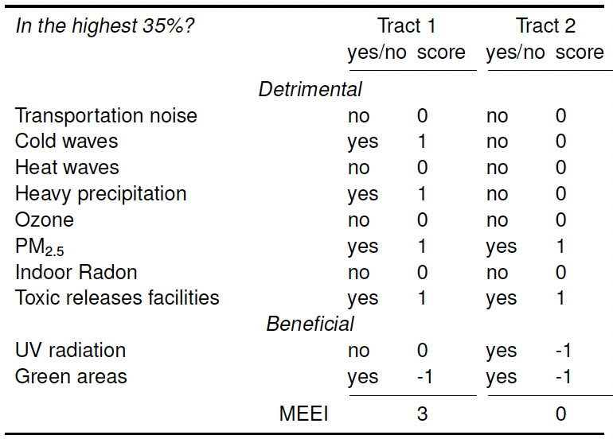

# MEII
US Census Tract Multi-Exposure Environmental Index (MEEI)

## Section 0: Introduction

Physical environment plays a key role in determining human health risks. Exposure to toxins, weather extremes, degraded air and water quality, high levels of noise and limited accessibility to green areas can negatively affect health. Furthermore, adverse environmental exposures are often correlated with each other and with socioeconomic status, thereby compounding disadvantages in marginalized populations. 
Moreover, despite their importance in determining human health risks,  the role of multiple environmental exposures is not well studied, and only a few resources contain aggregate environmental exposure data and only for selected areas of the contiguous US. To fill these gaps, we took a cumulative approach to measuring the environment by generating a composite Multi-Exposure Environmental Index (MEEI) as a US Census Tract-level summary of key environmental factors with known health effects. This measure quantifies multiple environmental exposures in the same area that can result in additive and synergistic effects on health outcomes. This information is crucial to better understand and possibly leverage environmental determinants of health for informed policy-making and intervention.


## Section 1: Data

Description, source, and link details about the data sources acquired as key environmental factors of the multi-exposure index.
<p align="center">

</p>


The key environmental factors with known health effects used to generate the multi-exposure index are available here: 
MEII_data.csv

```{r}
# Environmental exposures factors
df <- read.csv("MEII_data.csv")
df$GEOID = as.character(as.numeric(df$GEOID))
head(df)
```

The 2019 Cartographic Boundary Shapefile, Current Census Tract for United States, 1:500,000 is available here:
[cb_2019_us_tract_500k.zip](https://www2.census.gov/geo/tiger/GENZ2019/shp/cb_2019_us_tract_500k.zip)

```{r}
# US Censust tract geography
tracts  <- st_read('cb_2019_us_tract_500k/cb_2019_us_tract_500k.shp')
tracts$GEOID = as.character(as.numeric(tracts$GEOID))
head(tracts)
```


```{r}
# Combined data
left_join(tracts, df, by = 'GEOID') -> MapData 
projected = st_transform(MapData, 3085)
projected = projected[!(projected$ST %in% c("02", "15", "60","66","69","72","78")),]
```


## Section 2: Maps of environmental exposures factors

Selected environmental factors used to compute MEEI:

<p align="center">

</p>

Spatial distribution of the selected environmental factors used to compute MEEI:

<p align="center">
<figure class="half">
  <table>
    <tr>
      <td>
        
      </td>
      <td>
        
      </td>
    </tr>
  </table>
</figure>

<p align="center">
<figure class="half">
  <table>
    <tr>
      <td>
        
      </td>
      <td>
        
      </td>
    </tr>
  </table>
</figure>

<p align="center">
<figure class="half">
  <table>
    <tr>
      <td>
        
      </td>
      <td>
        
      </td>
    </tr>
  </table>
</figure>

<p align="center">
<figure class="half">
  <table>
    <tr>
      <td>
        
      </td>
      <td>
        
      </td>
    </tr>
  </table>
</figure>

<p align="center">
<figure class="half">
  <table>
    <tr>
      <td>
        
      </td>
       <td>
        
      </td>
    </tr>
  </table>
</figure>


## Section 3: Multi-Exposure Environmental Index (MEEI)


We computed a composite Multi-Exposure Environmental Index (MEEI) that can be used to characterize CTs for multiple environmental factors.  This index reflects the number of environmental factors in each CT and their detrimental or beneficial levels. The index is then ranked to distinguish areas with greater or lesser environmental deprivation. Health-relevant levels are calculated based on the distribution of values for each factor. This enables us to identify CTs in the top 35th exposure percentile and assign a score of +1 for detrimental dimensions or -1 for beneficial dimensions. Here is an example illustrating the calculation of the index for two specific tracts.


<p align="center">

</p>


```{r}
X <- projected[,c("heavyprec","heatw","coldw","tri","greenaopens",
                  "pm25","ozone","uv","noisemax","radcont")]

topQ <- apply(X,2,function(x) quantile(as.numeric(unlist(x)),0.65,na.rm=T))

# detrimental (+1): 
heavyprec <- ifelse(projected$heavyprec > topQ["heavyprec"],1,0)
coldw <- ifelse(projected$coldw > topQ["coldw"],1,0)      
heatw <- ifelse(projected$heatw > topQ["heatw"],1,0)   
ozone <- ifelse(projected$ozone > topQ["ozone"],1,0)
pm25 <- ifelse(projected$pm25 > topQ["pm25"],1,0)
radcont <- ifelse(projected$radcont > topQ["radcont"],1,0)
tri <- ifelse(projected$tri > topQ["tri"],1,0)
noisemax <- ifelse(projected$noisemax > topQ["noisemax"],1,0)
# beneficial (-1): 
greenaopens <- ifelse(projected$greenaopens > topQ["greenaopens"],-1,0)
uv <- ifelse(projected$uv > topQ["uv"],-1,0)

trvars <- cbind(
  # detrimental (+1): 
  heavyprec,heatw,coldw,tri,
  pm25,ozone,noisemax,radcont,
  # beneficial (-1): 
  greenaopens,uv)

projected$MEII <- factor(rowSums(trvars, na.rm = T), 
                  levels = range(as.numeric(rowSums(trvars, na.rm = T)),na.rm=T)[1]:range(as.numeric(rowSums(trvars, na.rm = T)),na.rm=T)[2])
```

Spatial distribution of the MEEI:

```{r}
tm_shape(projected) + 
  tm_fill("MEII",
          style = "quantile",
          palette =  hcl.colors(5, "Geyser"),  
          title = "")  +
  tm_layout(legend.text.size = 1,
            legend.title.size = 0.8,
            main.title = "US Census Tract Multi-Exposure Environmental Index (MEEI)",
            main.title.size = 1.5,
            legend.position = c("right", "bottom"),
            frame = FALSE)+
  tm_borders(alpha=.9,lwd=0)  + 
  tm_scale_bar(text.size = 0.6,position=c("left", "bottom"))
```

<p align="center">

</p>


The MEEI has ten levels that range from the least deprived (-2) to the most deprived (+7) CTs. The total count of CTs is lower for values at the tails of the index (classes -2, -1, 6, and 7).
While there is spatial heterogeneity, areas in the mid-West have the highest levels of environmental deprivation. Tracts in Michigan, and New York have the lowest environmental deprivation.

```{r}
table(projected$MEII)
round(table(projected$MEII)/72333*100,2)
```


| MEII class |    -2 |    -1 |     0 |     1  |    2   |   3   |   4   |   5   |   6   |    7 |
| ---------- | ------| ------| ------| -------| -------| ------| ------| ------| ------| ---- |
| N CTs      |    64 | 1,829 | 8,529 | 15,874 | 18,568 |14,932 | 8,365 | 3,298 |  770  | 104  |
| %          |  0.09 |  2.53 | 11.79 |  21.95 |  25.67 | 20.64 | 11.56 |  4.56 | 1.06  | 0.14 |


Distribution of each factor by MEEI values. A trend line shows the smoothed conditional means of each measure across bins of the MEEI.

```{r}
means = apply(X[-c(ncol(X))],2,mean)
col_names <- colnames(X)
col_names <- col_names[-c(ncol(X))]

colsc <- c("noisemax"="#F1E2CC", "heavyprec"="#FDCDAC", 
           "coldw"="#FDCDAC","heatw"="#FDCDAC", "pm25"="#F4CAE4", 
           "ozone"="#F4CAE4", "radcont" = "#CBD5E8",
           "uv"="#FFF2AE",
           "greenaopens"="#B3E2CD","greena"="#B3E2CD","opens"="#B3E2CD","tri"="#CCCCCC")
namesc <- c("noisemax"="Transportation noise", 
            "heavyprec"= "Heavy precipitation", "coldw"="Cold waves", 
            "heatw"="Hot waves","pm25"="PM 2.5","ozone"="Ozone", "radcont" = "Indoor radon",
            "uv"="UV radiation","greenaopens"="Green areas including open space","greena"="Green areas","tri"="Toxic releases facilities")


plot_list <- list()
for (i in col_names){
  plot <- ggplot(projected, aes_string(x="MEII", y=i)) +
    geom_boxplot() + 
    geom_violin(trim=F,fill=colsc[i]) +
    theme_light() +
    geom_hline(yintercept = means[i]) +
    stat_smooth(method = "gam", se=TRUE, aes(group=1),formula = y ~ splines::ns(x, 6)) + #splines::ns(x, 3)) +
    labs(x = "MEII Class", y = namesc[i]) +
    theme(text = element_text(size = 18))
  plot_list[[i]] <- plot
}
plot_grob <- arrangeGrob(grobs=plot_list)
grid.arrange(plot_grob)
```

<p align="center">

</p>

